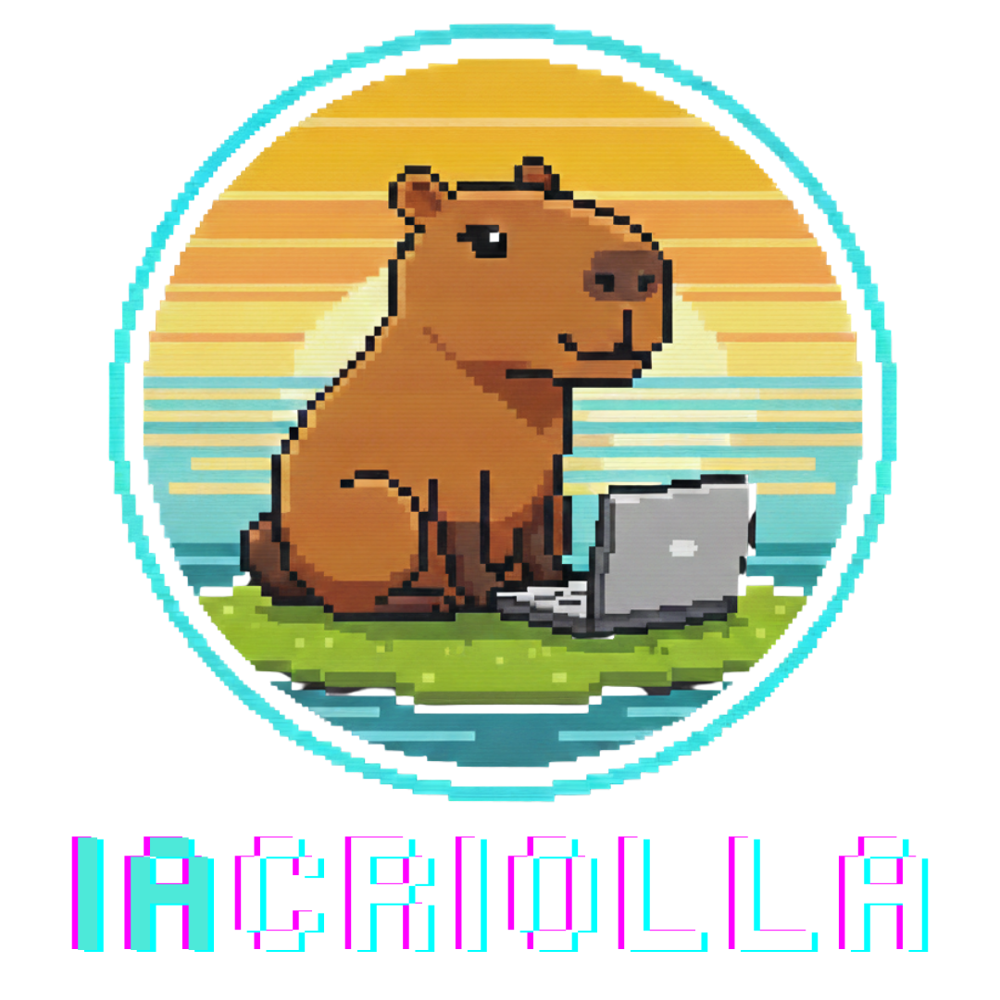

  

 

**The Stack**

---

## 🚀 Portfolio

Bienvenido al repositorio central de **IAcriolla**. 
Este espacio está dedicado a la construcción de soluciones de Inteligencia Artificial, ingeniería de datos y automatización.

Aquí encontrarás una colección de proyectos variados como:

*   📊 **Análisis y Procesamiento de Datos**
*   🤖 **Agentes de IA y RAG**
*   🛠️ **Automatización de Procesos**

---

### 📂 Proyectos Destacados

*Construyendo el futuro, commit a commit.*